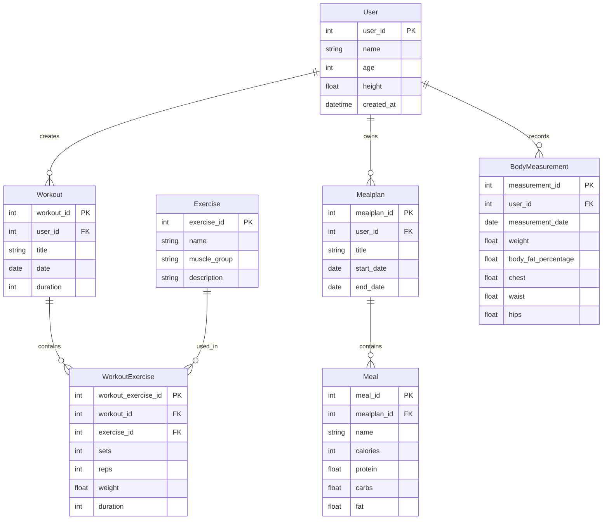

# MyTrainer

Fitness Tracker 
Dieses Projekjt ist eine Java-Anwendung zur Verwaltung von Trainingsplänen, Mahlzeiten und Fitnessfortschritten. Die Anwendung ermöglischt es Benutzern, Übungen zu erstellen, Gerichte zu entdecken und seinen Fortschritt zu Dokumentieren.

## Funktion 

-Benutzerverwaltung 

-Erstellen und Verwalten von Trainingsplänen

-Bmi Rechner

-Speichern von Trainingseinheiten

-Entdeckung allerlei Gerichten

-Datenbankbindung mit Hibernate

## Verwendete Technologien 

-Java

-Hibernate

-JPA

-MySQL

-Git und GitHub

-DAO-Pattern

## Projektstruktur 

-entity - Enthält die Entity-Klassen

-dao- Enthält die DAO Klassen für den Datenbankzugriff

-util- Enthält die HibernateUtil

-service - Enthält die Geschäftslogik

-main - Startpunkt der Anwendung

## Skizzenleiter
User

│

├── BodyMeasurement

├── Workout

│   └── WorkoutExercise

│       └── Exercise

├── MealPlan

│   └── Meal

